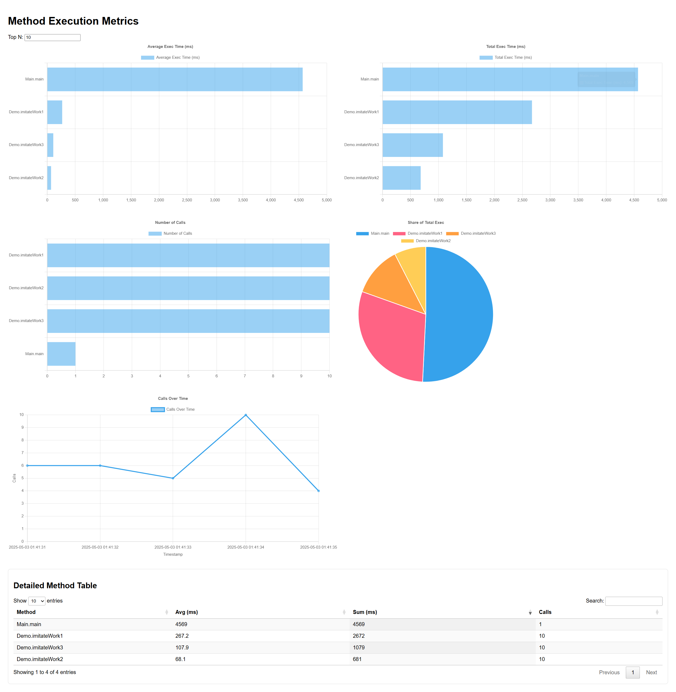

# Method Execution Metrics Sample
This is a minimal Java 21 + Gradle project that measures and reports execution times of your methods using AspectJ
load-time weaving. The aspect wraps every call matching your pointcut, logs “Class.method executed in X ms” to a
dedicated log file, then a Gradle task turns that log into an interactive HTML report.

## How it works
• The AspectJ agent (aspectjweaver.jar) is attached at runtime (via –javaagent) in both the runSample and test tasks.\
• MethodMetricsAspect uses a Pointcut annotation (default: `execution(* by.bivis..*(..))`) to select which methods to
time. You should replace that expression with one matching your own package.\
• Each timed call is written by SLF4J/Logback into build/aspect\_method\_metrics.log.\
• The generateMethodMetricsReport task parses the log, computes per-method sum, count, average and a time-series,
converts it all to JSON and injects it into docs/methodMetrics/template.html.

## Getting started
1. Run tests (with metrics):\
   `./gradlew clean test`
2. Or run the demo main:\
   `./gradlew runSample`
3. Generate the report:\
   `./gradlew generateMethodMetricsReport`
4. Open build/methodMetrics.html in your browser

## Result
You’ll get a standalone HTML page with interactive bar charts (average, total time, call count), a pie chart of
time-share, a line chart of calls over time, and a searchable, sortable table of all methods.

